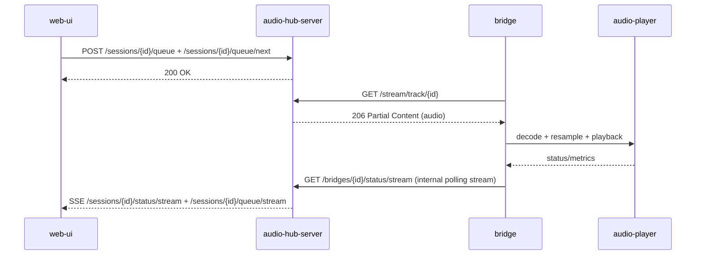
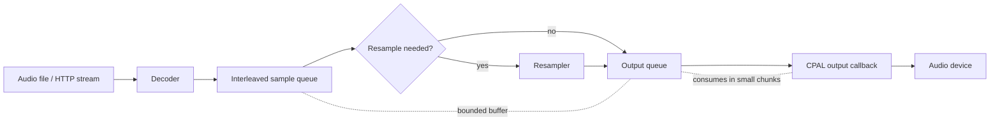
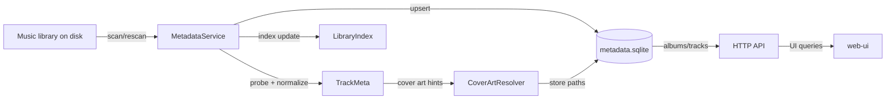
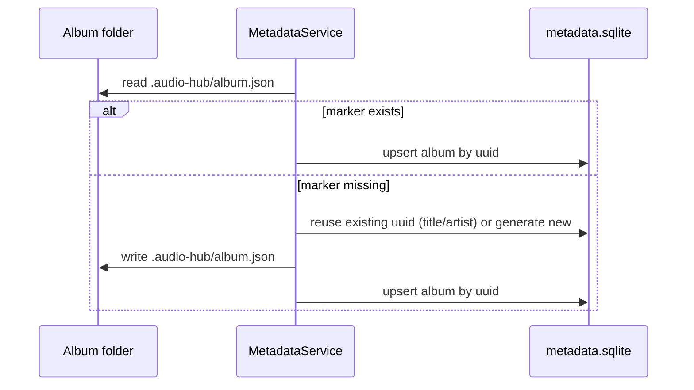
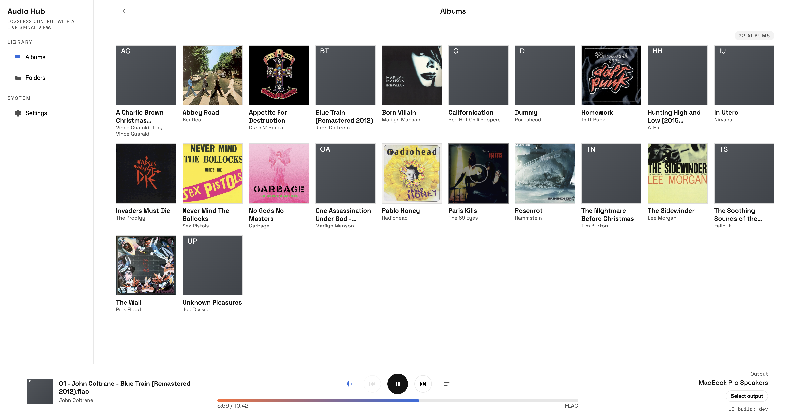
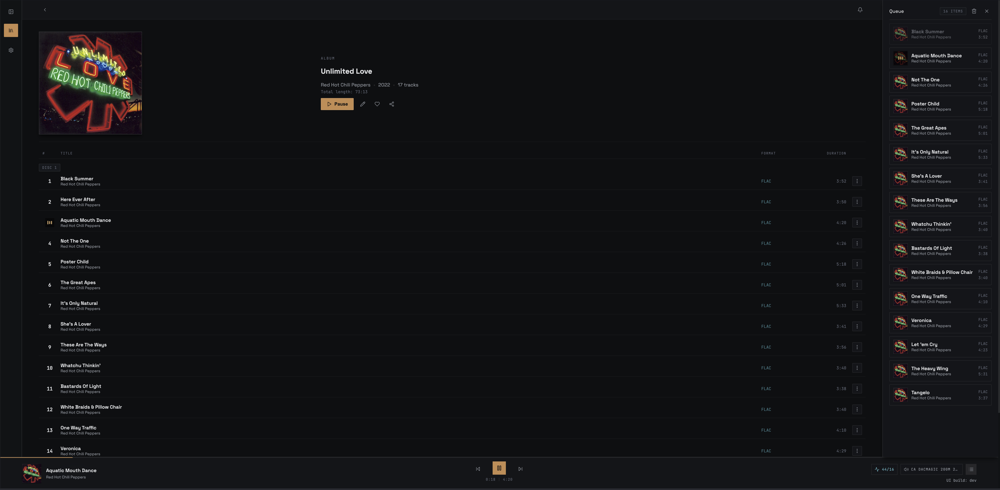
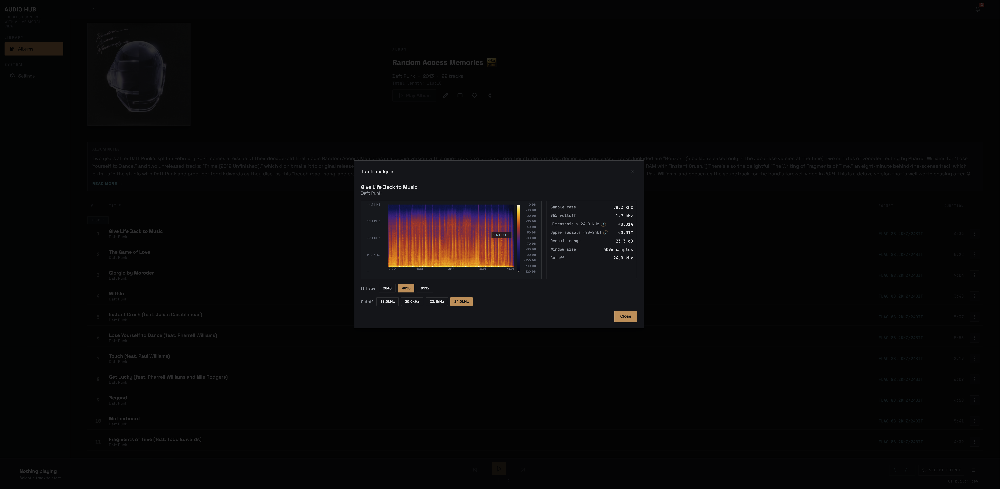

# audio-hub

[](https://github.com/dariusbakunas/audio-bridge/actions/workflows/ci.yml)
[](https://coveralls.io/github/dariusbakunas/audio-bridge?branch=main)

Stream audio files from your laptop/desktop to a small network “receiver” (perfect for a Raspberry Pi connected to a USB DAC).

This repo is a Rust workspace with two main apps:

- **`bridge`** (receiver): runs on the target machine (e.g. RPi). Exposes an HTTP control API, pulls audio via HTTP, decodes and plays through the selected output device.
- **`audio-hub-server`** (server): runs on the media rack. Scans your library and exposes an HTTP API for control + streaming.

Each binary supports `--version`, which includes the crate version, git SHA, and build date.

## Architecture

- `audio-player`: shared decode/resample/queue/playback building blocks
- `bridge`: thin HTTP-controlled receiver that uses `audio-player`
- `audio-hub-server`: scans the library, manages outputs, and streams audio to the bridge

### Playback flow

1. `web-ui` (or another client) creates/refreshes a playback session and binds an output to that session.
2. The client sends session-scoped play/seek/queue commands (`/sessions/{id}/...`).
3. `audio-hub-server` resolves the selected output and exposes `/stream/track/{id}` for the current track.
4. `bridge` pulls the stream over HTTP range requests and decodes via `audio-player`.
5. `audio-player` resamples if needed, fills the queue, and pushes samples to the output device.
6. Status and queue updates stream from the hub over session SSE endpoints (no polling).



### audio-player pipeline (conceptual)



Notes:
- Decoder produces interleaved `f32` samples.
- Resampler is inserted only when source and output rates differ.
- Queues are bounded to balance latency and underrun resistance.

### Metadata architecture (conceptual)



Notes:
- `MetadataService` orchestrates scans, normalization, DB writes, and index updates.
- `metadata.sqlite` is the source of truth for album/artist/track metadata used by the UI and playback.

### Album marker flow (optional)



### Outputs + providers

- Providers expose outputs (devices). Sessions bind outputs via locks so one output is used by at most one session at a time.
- `bridge` outputs are discovered via mDNS and status streams over HTTP (SSE).
- Local outputs (optional) reuse the same control path as bridge outputs.
- Browser local playback is client-managed per local session and controlled via session HTTP endpoints.

### Status + UI

- The bridge reports playback + signal data; the hub caches it and serves session status via `/sessions/{id}/status` and `/sessions/{id}/status/stream`.

## What this is for

If you have a quiet little box on your network (RPi + USB DAC) and you want:

- “Pick a FLAC/WAV on my laptop”
- “Play it on the Pi”
- “Pause/Resume/Next from the sender UI”

…this project is for you.

## Supported formats

Library scanning recognizes: **flac, wav, aiff/aif, mp3, m4a, aac, alac, ogg/oga, opus**.  
Decoding is provided by Symphonia; exact coverage depends on enabled features and container support.

## Quick start (local network)

### 1) Run the receiver on the Pi (or any Linux box)

```bash
cargo run --release -p bridge -- --http-bind 0.0.0.0:5556 listen
```

Optional: list output devices and choose one by substring:

```bash
cargo run --release -p bridge -- --list-devices
cargo run --release -p bridge -- --device "USB" --http-bind 0.0.0.0:5556 listen
```

If the hub server uses a self-signed TLS cert and the bridge host doesn’t trust it, add `--tls-insecure`.

### 2) Run the sender on your machine

First start the server on the machine that hosts your media (config is required):

```bash
cargo run --release -p audio-hub-server -- --bind 0.0.0.0:8080 --config crates/audio-hub-server/config.example.toml
```

Then open the web UI at `http://<SERVER_IP>:8080/` (or `https://...` when TLS is enabled).

## Docker (audio-hub-server)

Build the image:

```bash
docker build -f Dockerfile.server -t audio-hub-server:local .
```

Run it (mount your config + media library):

```bash
docker run --rm \
  --network host \
  -v "$(pwd)/crates/audio-hub-server/config.example.toml:/config/config.toml" \
  -v "/path/to/music:/music" \
  audio-hub-server:local
```

Or use compose:

```bash
export AUDIO_HUB_MEDIA_DIR=/path/to/music
docker compose up --build -d
```

Notes:
- `docker run` example uses host networking, so no `-p` flag is needed.
- `--config /config/config.toml` is required by the server entrypoint.
- The image includes `web-ui/dist`, so the dashboard is served at `/` out of the box.
- Mount config read/write so UI-persisted output settings can be written back to config.
- Update the mounted config so `media_dir` points to the container path (for example `/music`).
- Mount media read/write so the server can write metadata DB/artifacts and album marker files.
- Compose uses `network_mode: host` (no port mapping required in `docker-compose.yml`).
- Host networking is intended for Linux hosts; Docker Desktop (macOS/Windows) has limitations.

### Docker Hub publish (GitHub Actions)

The repository includes `.github/workflows/docker-image.yml` for multi-platform image publishing (`linux/amd64`, `linux/arm64`) to Docker Hub on version tags.

Configure these GitHub Actions repository secrets:
- `DOCKERHUB_USERNAME` (your Docker Hub username)
- `DOCKERHUB_TOKEN` (Docker Hub access token)

Then push a version tag (for example `v0.12.0` or `0.12.0`) to publish:

```bash
git tag v0.12.0
git push origin v0.12.0
```

## Web UI (experimental)

The hub server can serve a lightweight web dashboard if `web-ui/dist` is present next to the repo (or next to the binary).





Build the UI:

```bash
cd web-ui
npm install
npm run build
```

Then start `audio-hub-server` as usual and open `http://<SERVER_IP>:8080/`.

The browser UI supports local playback via the built-in `Local` session; no browser output selection is required.

### Track analysis (experimental)

The web UI includes an on-demand track analysis modal (spectrogram + basic heuristics). It runs entirely on the server when you click **Analyze track** in the track menu and does not precompute anything during library scans.



For local development:

```bash
cd web-ui
npm install
npm run dev
```

By default the Vite dev server proxies API requests to `http://localhost:8080`. If your hub server is on a different host/port, set `VITE_API_BASE` when running `npm run dev`.

If you enable TLS on the hub server, use `https://` for `VITE_API_BASE` and in the desktop app connection settings.

## Desktop App (Tauri)

The desktop app reuses the existing React/Vite UI and runs inside a Tauri shell.

### Dev

```bash
cd web-ui
npm install
VITE_API_BASE=https://<SERVER_IP>:8443 npm run tauri:dev
```

### Build

```bash
cd web-ui
VITE_API_BASE=https://<SERVER_IP>:8443 npm run tauri:build
```

## Server config

Use a TOML config to define the media path and outputs:

```toml
# Example audio-hub-server config
#
# bind: HTTP address the server listens on
# public_base_url: base URL reachable by the bridge (used for /stream URLs)
# tls_cert: path to a PEM-encoded TLS certificate (optional)
# tls_key: path to a PEM-encoded TLS private key (optional)
# bridges: list of bridge devices to connect to
# local_outputs: enable local outputs on the hub host
# local_id/name/device: optional overrides for local outputs
# musicbrainz: optional metadata enrichment settings (requires user_agent)
# note: enrichment runs in a background job and only fills missing MBIDs

bind = "0.0.0.0:8443"
public_base_url = "https://192.168.1.10:8443"
media_dir = "/srv/music"
# local_outputs = true
# local_id = "local"
# local_name = "Local Host"
# local_device = ""

# [musicbrainz]
# enabled = true
# user_agent = "audio-hub/0.1 (you@example.com)"
# base_url = "https://musicbrainz.org/ws/2"
# rate_limit_ms = 1000

[[bridges]]
id = "living-room"
name = "Living Room"
http_addr = "192.168.1.50:5556"
```

`public_base_url` must be reachable by the bridge so it can pull `/stream` URLs (set it to the server’s LAN IP + port). Pass config via `--config` (you can still override the media path via `--media-dir`). If `--config` is omitted, the server will look for `config.toml` next to the binary.

If you enable TLS, update `public_base_url` to use `https://` and the TLS port.

```bash
cargo run --release -p audio-hub-server -- --bind 0.0.0.0:8080 --config crates/audio-hub-server/config.example.toml
```

To enable HTTPS, provide a certificate and key (PEM):

```bash
cargo run --release -p audio-hub-server -- \
  --bind 0.0.0.0:8443 \
  --tls-cert /path/to/cert.pem \
  --tls-key /path/to/key.pem \
  --config crates/audio-hub-server/config.example.toml
```

Generate a local self-signed cert for development:

```bash
mkdir -p certs
openssl req -x509 -newkey rsa:2048 -nodes -days 365 \
  -keyout certs/local.key \
  -out certs/local.crt \
  -subj "/CN=localhost"
```

Then run:

```bash
cargo run --release -p audio-hub-server -- \
  --bind 0.0.0.0:8443 \
  --tls-cert certs/local.crt \
  --tls-key certs/local.key \
  --config crates/audio-hub-server/config.example.toml
```

For a trusted local cert on macOS, use `mkcert` (recommended):

```bash
scripts/gen-dev-cert-mkcert.sh 192.168.1.10 localhost
```

## Tuning playback stability vs latency

`bridge` exposes a few knobs that trade latency for underrun resistance.

- **Default (USB stable)**  
  `--buffer-seconds 2.0 --chunk-frames 1024 --refill-max-frames 4096`

- **Paranoid stable (busy CPU / recording session vibes)**  
  `--buffer-seconds 4.0 --chunk-frames 2048 --refill-max-frames 8192`

- **Lower latency (snappier start/stop, requires a happier system)**  
  `--buffer-seconds 0.75 --chunk-frames 512 --refill-max-frames 2048`

Example:

```bash
cargo run --release -p bridge --
--buffer-seconds 2.0
--chunk-frames 1024
--refill-max-frames 4096
--http-bind 0.0.0.0:5556
listen
```

## Server API (quick map)

- `GET /library` (list a directory; use `?dir=...`)
- `POST /library/rescan`
- `POST /sessions` (create/refresh session)
- `GET /sessions`
- `GET /sessions/locks`
- `POST /sessions/{id}/select-output`
- `POST /sessions/{id}/release-output`
- `POST /sessions/{id}/heartbeat`
- `GET /sessions/{id}/status`
- `GET /sessions/{id}/status/stream`
- `POST /sessions/{id}/pause`
- `POST /sessions/{id}/seek`
- `POST /sessions/{id}/stop`
- `GET /sessions/{id}/queue`
- `POST /sessions/{id}/queue`
- `POST /sessions/{id}/queue/next/add`
- `POST /sessions/{id}/queue/remove`
- `POST /sessions/{id}/queue/play_from`
- `POST /sessions/{id}/queue/clear`
- `POST /sessions/{id}/queue/next`
- `POST /sessions/{id}/queue/previous`
- `GET /sessions/{id}/queue/stream`
- `POST /local-playback/register`
- `POST /local-playback/{session_id}/play`
- `GET /local-playback/sessions`
- `GET /stream` (range-enabled)
- `GET /providers`
- `GET /providers/{id}/outputs`
- `GET /outputs`
- `POST /outputs/select`
- `GET /swagger-ui/` (OpenAPI UI)

Notes:
- Provider IDs are namespaced by kind (e.g. `bridge:roon-bridge`).
- Output IDs include kind + provider + device (e.g. `bridge:roon-bridge:alsa:hw:CARD=DAC,DEV=0`).

## Local Outputs

To expose local audio devices on the hub server itself, enable local outputs in
`config.toml` via `local_outputs` (see `crates/audio-hub-server/config.example.toml`).
This adds a provider `local:local` (id configurable) that lists the host’s devices
and plays locally without running a separate bridge.

## Releases

See `CHANGELOG.md` for release notes and version history.

Releases are handled by `cargo-dist` via GitHub Actions. Tag a version (e.g. `v0.1.1`) to trigger builds for all configured targets.

Tauri desktop bundles are built in a separate GitHub Actions workflow and attached to the same GitHub Release tag.

### Releasing a single crate

If you only want to publish one binary, bump that crate’s version and tag using the `package/version` format.

## Why not AirPlay?

This is a direct, local-network stream to a dedicated receiver. Audio is decoded on the receiver and resampled to the output device’s native rate, avoiding protocol-level caps and keeping the path simple and controllable.

## Roadmap (nice-to-haves)

- Recursive library scanning / playlists
- More codecs/containers (and sender-side filtering)
- Better metadata (duration, sample rate) and progress UI polish
- Multiple receivers / discovery

## License

Licensed under the Apache License, Version 2.0. See `LICENSE` and `NOTICE`.
