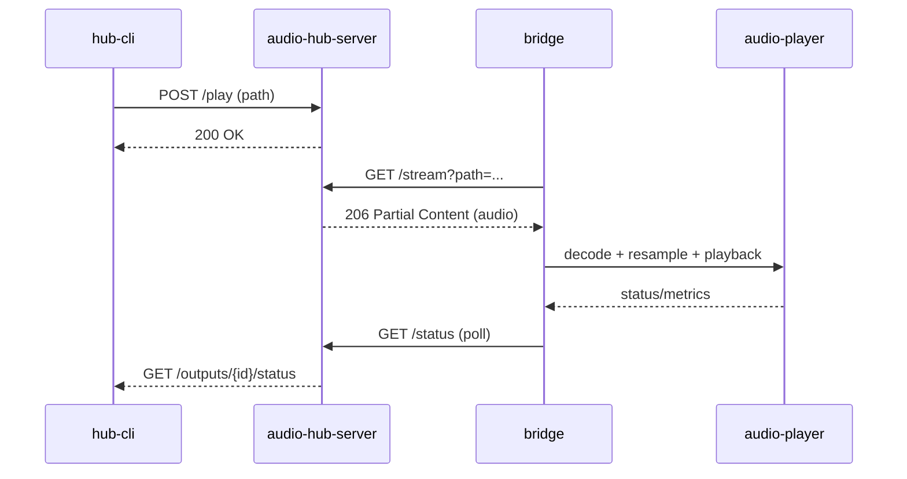
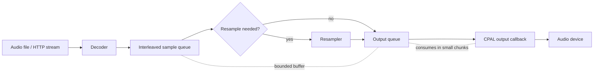
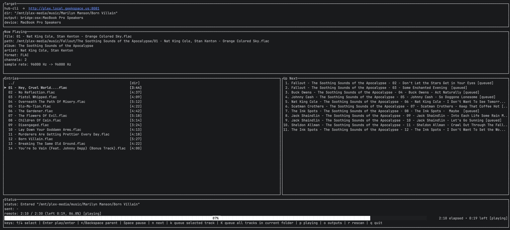

# audio-hub

[](https://github.com/dariusbakunas/audio-bridge/actions/workflows/ci.yml)
[](https://coveralls.io/github/dariusbakunas/audio-bridge?branch=main)

Stream audio files from your laptop/desktop to a small network “receiver” (perfect for a Raspberry Pi connected to a USB DAC).

This repo is a Rust workspace with two main apps:

- **`bridge`** (receiver): runs on the target machine (e.g. RPi). Exposes an HTTP control API, pulls audio via HTTP, decodes and plays through the selected output device.
- **`audio-hub-server`** (server): runs on the media rack. Scans your library and exposes an HTTP API for control + streaming.
- **`hub-cli`** (client): runs on your machine. A small TUI that connects to the server to browse and control playback.

Each binary supports `--version`, which includes the crate version, git SHA, and build date.

## Architecture

- `audio-player`: shared decode/resample/queue/playback building blocks
- `bridge`: thin HTTP-controlled receiver that uses `audio-player`
- `audio-hub-server`: scans the library, manages outputs, and streams audio to the bridge
- `hub-cli`: TUI client that talks to the server and renders UI from a view-model layer

### Playback flow

1. `hub-cli` sends play/seek/queue commands to `audio-hub-server`.
2. `audio-hub-server` resolves the selected output and exposes `/stream` for the current track.
3. `bridge` pulls the stream over HTTP range requests and decodes via `audio-player`.
4. `audio-player` resamples if needed, fills the queue, and pushes samples to the output device.



### audio-player pipeline (conceptual)



Notes:
- Decoder produces interleaved `f32` samples.
- Resampler is inserted only when source and output rates differ.
- Queues are bounded to balance latency and underrun resistance.

### Outputs + providers

- Providers expose outputs (devices). The hub keeps one active output at a time.
- `bridge` outputs are discovered via mDNS and polled over HTTP.
- Local outputs (optional) reuse the same control path as bridge outputs.

### Status + UI

- The bridge reports playback + signal data; the hub caches it and proxies via `/outputs/{id}/status`.
- `hub-cli` renders a view-model so UI formatting stays separated from app state.

## What this is for

If you have a quiet little box on your network (RPi + USB DAC) and you want:

- “Pick a FLAC/WAV on my laptop”
- “Play it on the Pi”
- “Pause/Resume/Next from the sender UI”

…this project is for you.

## Supported formats

Library scanning recognizes: **flac, wav, aiff/aif, mp3, m4a, aac, alac, ogg/oga, opus**.  
Decoding is provided by Symphonia; exact coverage depends on enabled features and container support.

## Quick start (local network)

### 1) Run the receiver on the Pi (or any Linux box)

```bash
cargo run --release -p bridge -- --http-bind 0.0.0.0:5556 listen
```

Optional: list output devices and choose one by substring:

```bash
cargo run --release -p bridge -- --list-devices
cargo run --release -p bridge -- --device "USB" --http-bind 0.0.0.0:5556 listen
```

### 2) Run the sender on your machine

First start the server on the machine that hosts your media (config is required):

```bash
cargo run --release -p audio-hub-server -- --bind 0.0.0.0:8080 --config crates/audio-hub-server/config.example.toml
```

Then point the TUI at the server:

```bash
 cargo run --release -p hub-cli -- --server http://<SERVER_IP>:8080 --dir <SERVER_MUSIC_DIR>
```

## Web UI (experimental)

The hub server can serve a lightweight web dashboard if `web-ui/dist` is present next to the repo (or next to the binary).

Build the UI:

```bash
cd web-ui
npm install
npm run build
```

Then start `audio-hub-server` as usual and open `http://<SERVER_IP>:8080/`.

For local development:

```bash
cd web-ui
npm install
npm run dev
```

By default the Vite dev server proxies API requests to `http://localhost:8080`. If your hub server is on a different host/port, set `VITE_API_BASE` when running `npm run dev`.

## Server config

Use a TOML config to define the media path, outputs, and default output:

```toml
# Example audio-hub-server config
#
# bind: HTTP address the server listens on
# public_base_url: base URL reachable by the bridge (used for /stream URLs)
# bridges: list of bridge devices to connect to
# active_output: output id to use by default (bridge:{bridge_id}:{device_id})
# local_outputs: enable local outputs on the hub host
# local_id/name/device: optional overrides for local outputs

bind = "0.0.0.0:8080"
public_base_url = "http://192.168.1.10:8080"
media_dir = "/srv/music"
active_output = "bridge:living-room:Built-in Output"
# local_outputs = true
# local_id = "local"
# local_name = "Local Host"
# local_device = ""

[[bridges]]
id = "living-room"
name = "Living Room"
http_addr = "192.168.1.50:5556"
```

`public_base_url` must be reachable by the bridge so it can pull `/stream` URLs (set it to the server’s LAN IP + port). Pass config via `--config` (you can still override the media path via `--media-dir`). If `--config` is omitted, the server will look for `config.toml` next to the binary.

```bash
cargo run --release -p audio-hub-server -- --bind 0.0.0.0:8080 --config crates/audio-hub-server/config.example.toml
```

## hub-cli keys (TUI)

- **↑/↓**: select track
- **Enter**: play selected track (starts streaming immediately)
- **Space**: pause/resume
- **n**: next (skip immediately)
- **←/→**: seek −5s / +5s
- **Shift+←/Shift+→**: seek −30s / +30s
- **r**: rescan directory
- **q**: quit

### Hub-CLI screenshot



## Tuning playback stability vs latency

`bridge` exposes a few knobs that trade latency for underrun resistance.

- **Default (USB stable)**  
  `--buffer-seconds 2.0 --chunk-frames 1024 --refill-max-frames 4096`

- **Paranoid stable (busy CPU / recording session vibes)**  
  `--buffer-seconds 4.0 --chunk-frames 2048 --refill-max-frames 8192`

- **Lower latency (snappier start/stop, requires a happier system)**  
  `--buffer-seconds 0.75 --chunk-frames 512 --refill-max-frames 2048`

Example:

```bash
cargo run --release -p bridge --
--buffer-seconds 2.0
--chunk-frames 1024
--refill-max-frames 4096
--http-bind 0.0.0.0:5556
listen
```

## Server API (quick map)

- `GET /library` (list a directory; use `?dir=...`)
- `POST /library/rescan`
- `POST /play`
- `POST /pause`
- `POST /seek`
- `GET /queue`
- `POST /queue`
- `POST /queue/remove`
- `POST /queue/clear`
- `POST /queue/next`
- `GET /outputs/{id}/status`
- `GET /stream` (range-enabled)
- `GET /providers`
- `GET /providers/{id}/outputs`
- `GET /outputs`
- `POST /outputs/select`
- `GET /swagger-ui/` (OpenAPI UI)

Notes:
- Provider IDs are namespaced by kind (e.g. `bridge:roon-bridge`).
- Output IDs include kind + provider + device (e.g. `bridge:roon-bridge:alsa:hw:CARD=DAC,DEV=0`).

## Local Outputs

To expose local audio devices on the hub server itself, enable local outputs in
`config.toml` via `local_outputs` (see `crates/audio-hub-server/config.example.toml`).
This adds a provider `local:local` (id configurable) that lists the host’s devices
and plays locally without running a separate bridge.

## Releases

Releases are handled by `cargo-dist` via GitHub Actions. Tag a version (e.g. `v0.1.1`) to trigger builds for all configured targets.

### Releasing a single crate

If you only want to publish one binary (e.g. `hub-cli`), bump that crate’s version and tag using the `package/version` format:

```bash
git tag hub-cli/0.1.2
git push origin hub-cli/0.1.2
```

This triggers a release for just that package (the tag name must match the Cargo package name).

## Why not AirPlay?

This is a direct, local-network stream to a dedicated receiver. Audio is decoded on the receiver and resampled to the output device’s native rate, avoiding protocol-level caps and keeping the path simple and controllable.

## Roadmap (nice-to-haves)

- Recursive library scanning / playlists
- More codecs/containers (and sender-side filtering)
- Better metadata (duration, sample rate) and progress UI polish
- Multiple receivers / discovery

## License

Licensed under the Apache License, Version 2.0. See `LICENSE` and `NOTICE`.
