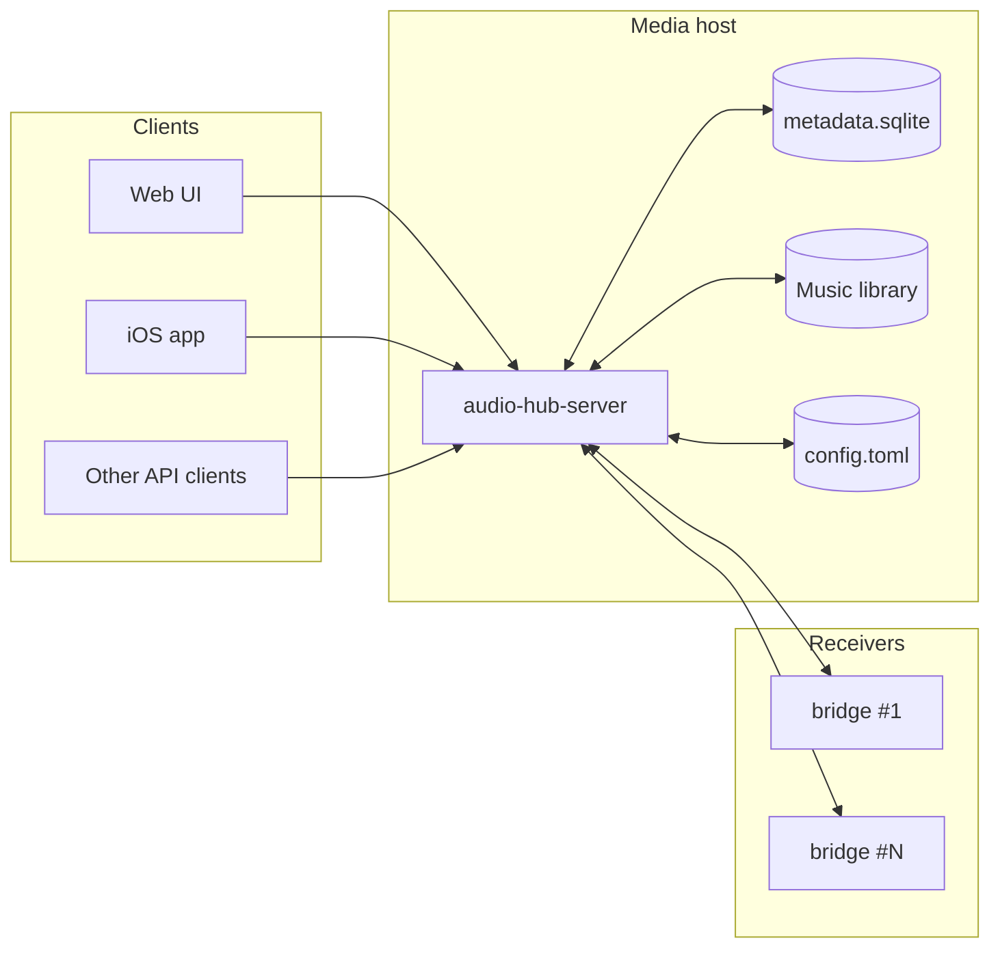
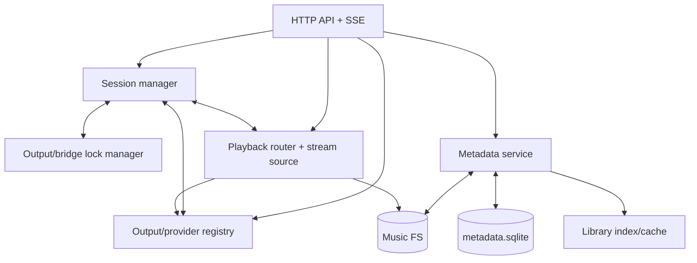
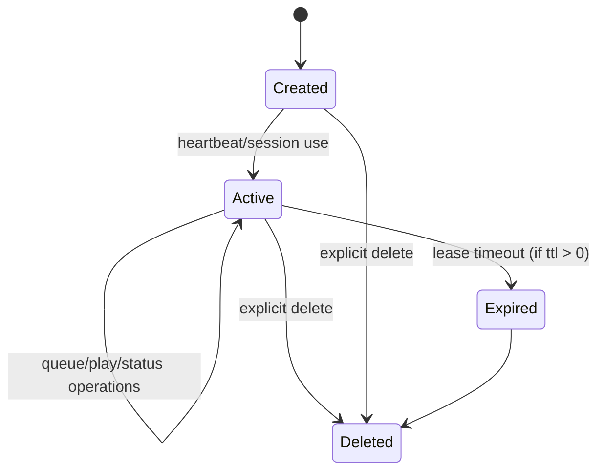
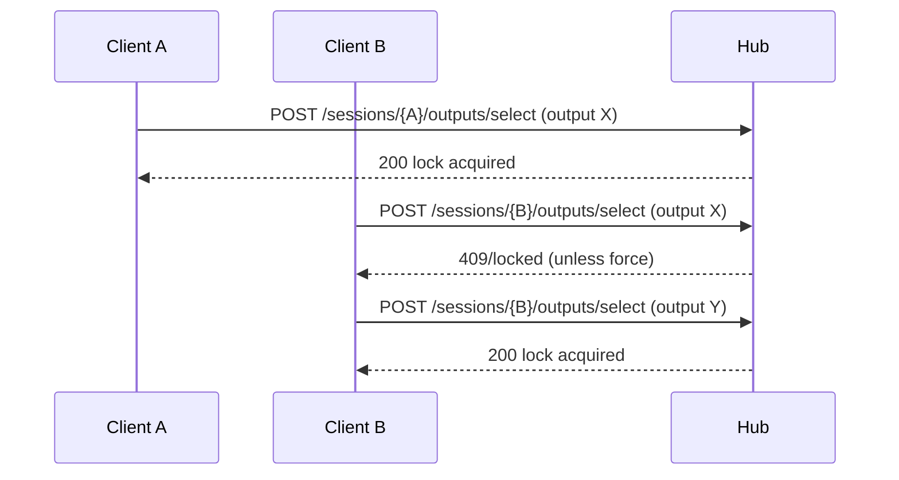
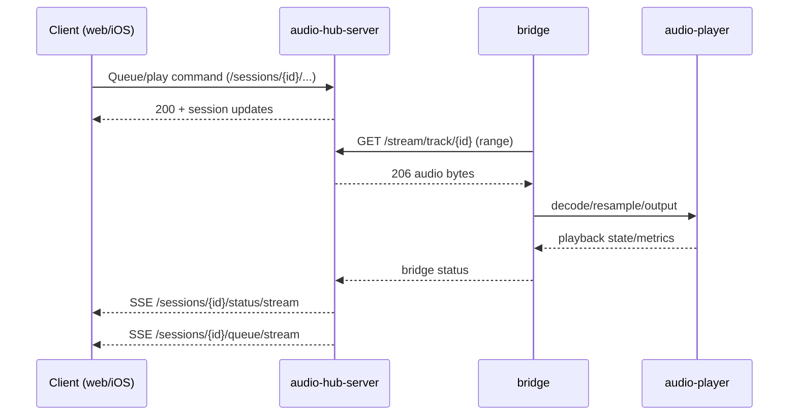
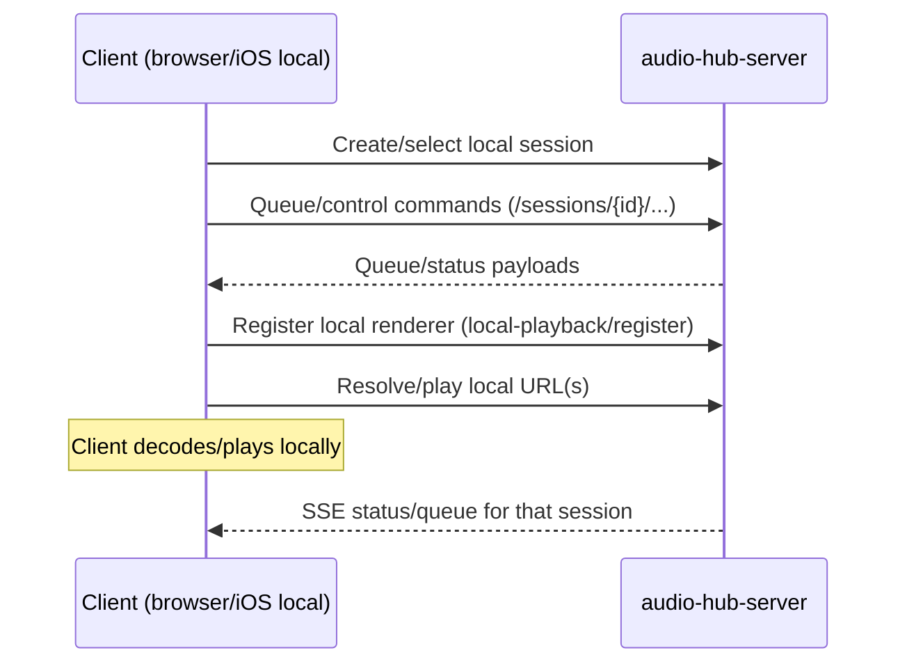
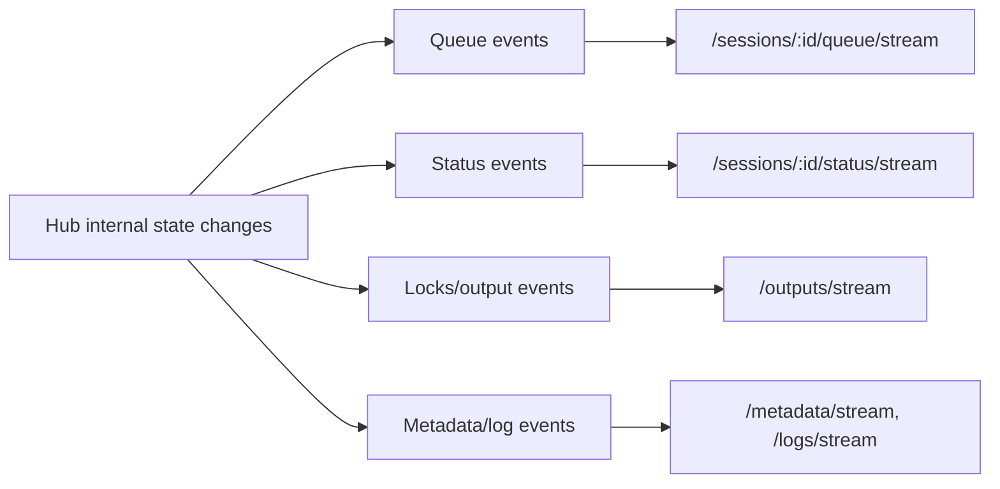
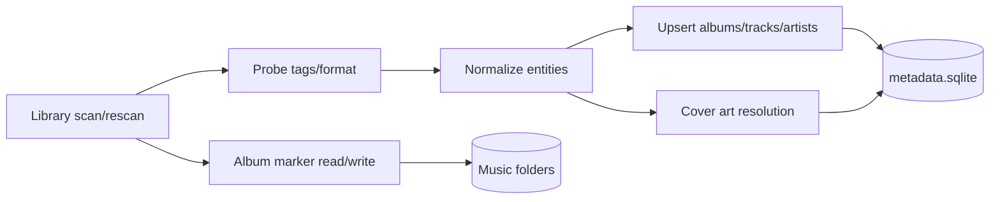
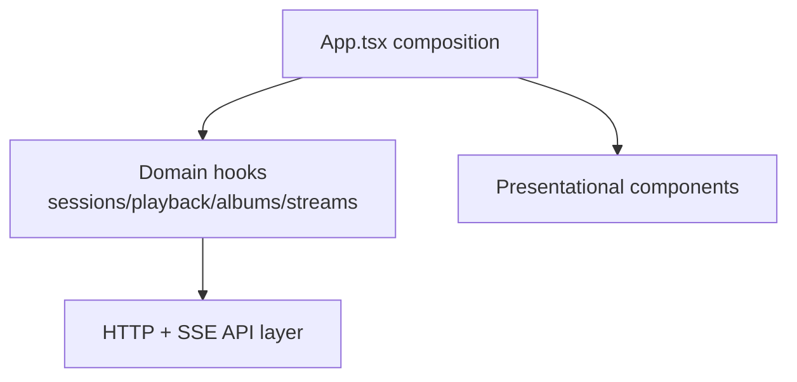

# Audio Hub Architecture

This document complements the README with deeper architecture diagrams for implementation and maintenance work.

## 1) Container view

## 2) Server component view (`audio-hub-server`)

## 3) Session lifecycle and ownership

Notes:
- Sessions scope queue, playback control, status, and volume/mute.
- Output/bridge locks are session-bound.
- Local sessions and remote sessions share session APIs, with different playback execution paths.

## 4) Output lock model

## 5) Remote playback flow (session -> bridge)

## 6) Local playback flow (client-managed renderer)

## 7) Event/update model

Notes:
- Web UI is SSE-first for queue/status/outputs.
- Local-mode mobile clients may reduce/suspend streams in background and rely on snapshots/polling when needed.

## 8) Metadata pipeline

## 9) Web UI architecture (high level)

The current refactor direction is to keep `App.tsx` as composition/orchestration and move behavior into focused hooks/components.
